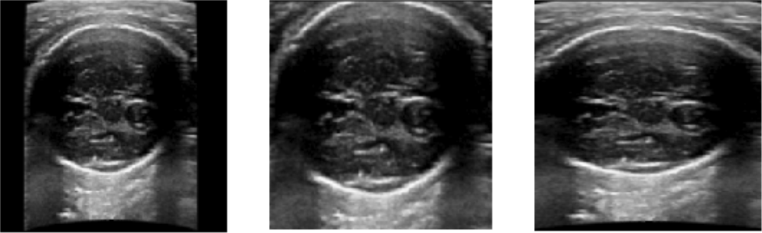
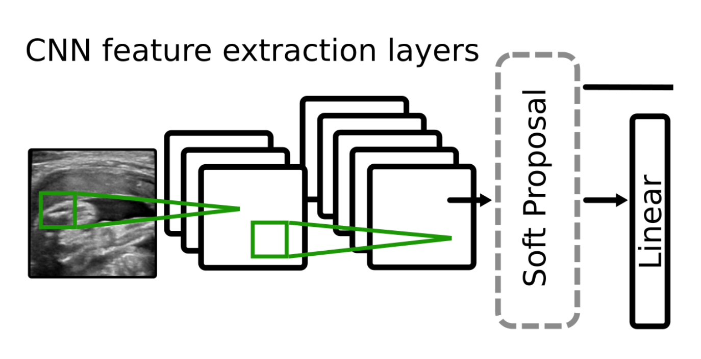
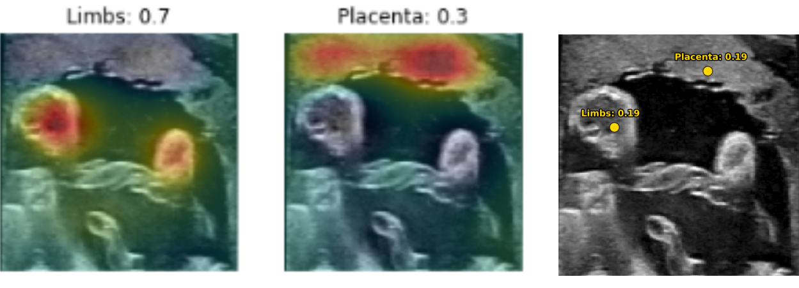

# Fetal Region Detection using PyTorch and Soft Proposal Networks

PyTorch implementation of the paper 'Weakly Supervised Localisation for Fetal Ultrasound Images', DLMIA'18

[[Project Page]](https://github.com/ntoussaint/fetalnav) [[Paper]](https://arxiv.org) [[Supp]]()


## Abstract

This work addresses the task of detecting and localising fetal anatomical regions in 2D ultrasound images, where only image-level labels are present at training, i.e. without any localisation or segmentation information. We examine the use of convolutional neural network architectures coupled with soft proposal layers. The resulting network simultaneously performs anatomical region detection (classification) and localisation tasks. We generate a proposal map describing the attention of the network for a particular class. The network is trained on 85,500 2D fetal ultrasound images and their associated labels. Labels correspond to six anatomical regions: head, spine, thorax, abdomen, limbs, and placenta. Detection achieves an average accuracy of 90% on individual regions, and show that the proposal maps correlate well with relevant anatomical structures. This work presents itself as a powerful and essential step towards subsequent tasks such as fetal position and pose estimation, organ-specific segmentation, or image-guided navigation.


## Requirements

* Cuda >= 8
* Python>=3.5
* PyTorch: `pip3 install torch torchvision`
* Other Packages: [torchnet](https://github.com/pytorch/tnt), [spn](https://github.com/yeezhu/SPN.pytorch)

## Usage

1. Install via pip:
    ```bash
    [sudo] pip install git+https://github.com/ntoussaint/fetalnav.git
    ```

2. Or fom source
    ```bash
    git clone https://github.com/ntoussaint/fetalnav.git
    cd fetalnav
    [sudo] python setup.py install
    ```

## Notebook examples

#### [Datasets and Transforms](experiments/transforms.ipynb)

Test the dataset loaders (using SimpleITK) and the different transforms



#### [Train fetalnav](experiments/train.ipynb)

Train your own fetalnav network and experiment with hyperparameter tuning



#### [Evaluate fetalnav](experiments/evaluate.ipynb)

Use the network to infer the region and localise regions in the image



## Citation

If you use this code in your research, please cite:
```bibtex
@inproceedings{toussaint.dlmia.18,
    author = {Toussaint, Nicolas and Khanal, Bishesh and Sinclair, Matthew and Gomez, Alberto and Skelton, Emily and Matthew, Jacqueline and Schnabel, Julia A.},
    title = {Weakly Supervised Localisation for Fetal Ultrasound Images},
    booktitle = {Proceedings of the 4th Workshop on Deep Learning in Medical Image Analysis},
    year = {2018}
}
```

## Acknowledgement
This work was supported by the Wellcome/EPSRC Centre
for Medical Eng. [WT203148/Z/16/Z], and the Wellcome IEH Award [102431]

## Author

    Nicolas Toussaint, PhD
    School of Biomedical Engineering,
    King's College London

**Contact**: <nicolas.a.toussaint@kcl.ac.uk> <nicolas.toussaint@gmail.com>
